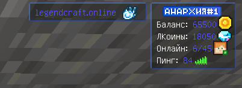

# ScoreHudRP - Ресурс-пак на скорборд для всех Bedrock серверов!

Этот ресурс-пак перемещает ваш скорборд в правый верхний угол экрана и добавляет синюю обводку. Пример ниже:  
  

## Установка
1. Скачайте `ScoreHud.zip`  
2. Поместите в папку `packs/` в зависимости от вашего ядра. Лично у меня GeyserMC, для PocketMine-MP добавьте в `resource_packs/` далее впишите его в `resource_packs.yml`  
3. Перезапустите сервер  

## Использование
Если хотите сделать скорборд как на скрине, то после каждой строчки ставьте "\n", то есть перенос строки! Например: `Баланс: %eco_balance%\nОнлайн: %online%/100\n`
